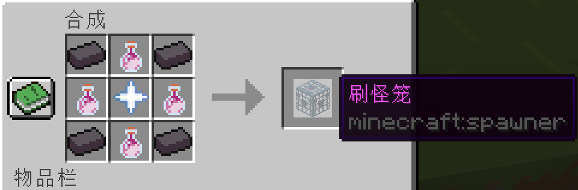
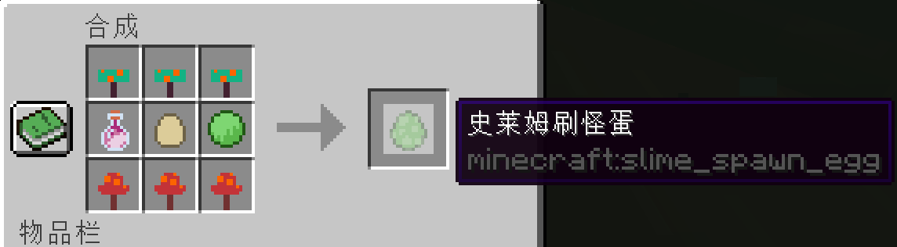

# mc-spawn
Minecraft data pack with recipes of spawner and spawn eggs 

我的世界数据包，提供刷怪笼和刷怪蛋的配方

The recipe of spawner includes a `nether_star`, 4 `netherite_ingot`, and 4 `dragon_breath`.

刷怪笼的配方包含一个下界之星，四个下界合计锭和四个龙息。

All recipes of spawn eggs always include 3 `warped_fungus` at the top, 3 `crimson_fungus` at the bottom, a `dragon_breath` at the left, an egg at the center. Finally, put a specific item at the right.

所有的刷怪蛋配方都包含三个诡异菌在顶部，三个绯红菌在底部，一个龙息在左边，一个鸡蛋在中间。最后放一个特异性物品在右边。